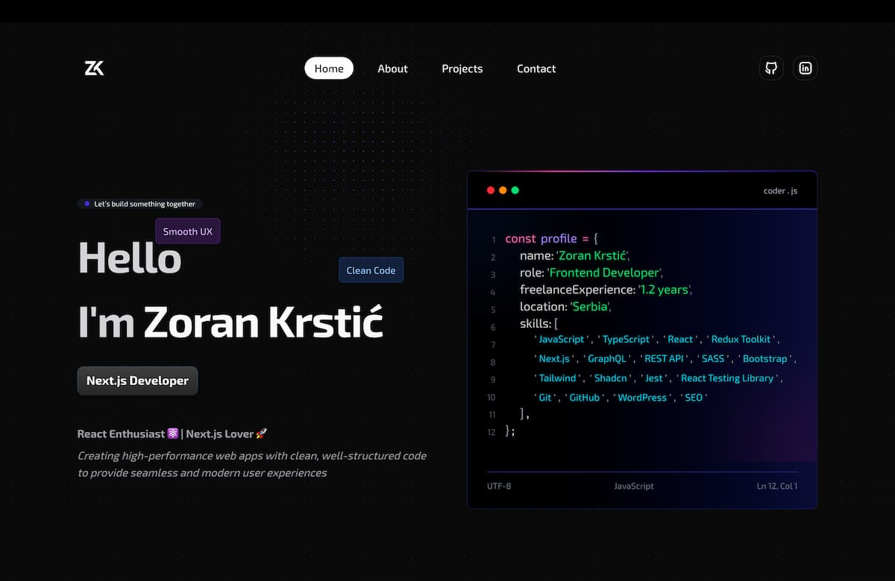

# 🚀 Zoran Krstić – Front-End Developer Portfolio

🔗 **Live Website**: [zkrstic.dev](https://zkrstic.dev)

---

## About

Hi! I'm **Zoran Krstić**, a front-end developer passionate about building clean, performant, and user-friendly web applications.  
This portfolio showcases my work, skills, and the technologies I use.

---

## Technologies Used

### Frameworks and Languages

- ⚛️ **Next.js** – React framework for building fast and scalable web apps.
- 🟩 **Supabase** – Open-source backend as a service providing PostgreSQL, authentication, and real-time APIs.
- 🟦 **TypeScript** – Typed superset of JavaScript for better safety and DX.

### Styling

- 🎨 **Tailwind CSS** – Utility-first CSS framework for rapid UI development.

### UI Component Libraries

- 🧱 **shadcn/ui** – Accessible, reusable UI components built with Tailwind CSS.
- ✨ **magic-ui** – A set of animated UI primitives and transitions.
- 🧬 **ui-aceternity** – A modern collection of animated and interactive UI components.

### Icons

- 🖼️ **Tabler Icons** – Crisp, customizable SVG icons.
- 🧩 **lucide-react** – Beautiful open-source icon library for React.

## Features

- ⚡ **Performance Optimized** – Achieves a 98+ score on Google PageSpeed Insights (mobile).
- 🧩 **Component-Based Structure** – Built with reusable and maintainable components.
- 🎨 **Modern Design** – Clean, minimal, and elegant UI following current design trends.
- 📱 **Fully Responsive** – Looks great and works smoothly across all devices and screen sizes.
- 🧠 **Accessibility-Focused** – Built with accessibility best practices in mind (100/100 Lighthouse score).
- 🎬 **Smooth Animations** – Subtle transitions and animations powered by Framer Motion.
- 📁 **Project Showcase** – Highlights selected real-world and demo projects.
- 📬 **Contact Form** – Easy way to get in touch directly from the site.

## Security and Anti-Spam Measures

To protect the contact form and comments system from spam and abuse, several techniques have been implemented:

🕳️ Honeypot Field – A hidden input that only bots tend to fill. If it’s filled, the submission is flagged as spam.

⏱️ Time-Based Check – If the form is submitted in under 3 seconds, it’s likely a bot and gets rejected.

🧼 Input Sanitization – All user input is sanitized to remove HTML tags and prevent cross-site scripting (XSS) or code injection.

🚫 Rate Limiting (Upstash Redis) – Each IP address is limited to a safe number of requests within a defined timeframe. Excessive submissions are temporarily blocked to prevent brute-force or spam attacks.

📏 Length Validation – Messages and comments have a maximum character limit (2,000 characters) to avoid abuse and excessive payloads.

🔒 Empty Input Check – Whitespace-only messages are ignored to ensure all submissions are meaningful.

## Status

Status

🚧 Currently under active development

The core of the portfolio is complete — fully responsive, performant, and visually polished.
The focus has now shifted toward expanding the Blog section, which is being built with Supabase as the backend.

Ongoing tasks:

📰 Integrating Supabase-powered Blog (blog list + single post pages)

💬 Developing the Comments system
